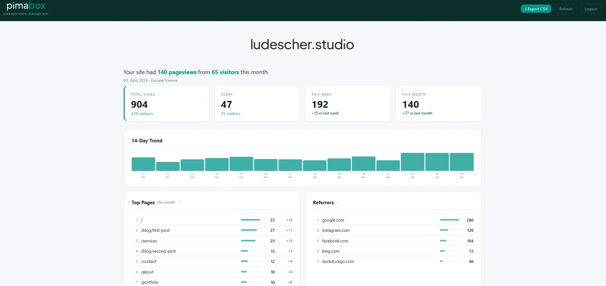
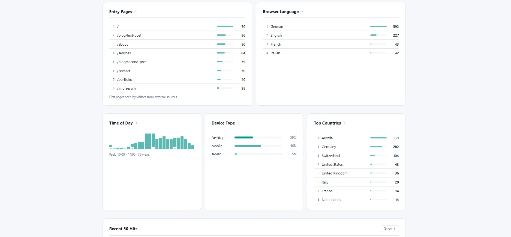

<p align="center">
  <picture>
    <source media="(prefers-color-scheme: dark)" srcset="assets/pimabox_dark_logo.svg">
    
  </picture>
</p>

> *Pima* (Swahili) — to measure, to assess.  
> *Box* — a self-contained system you drop in and it runs.  
> **pimabox** is exactly that: a compact, silent little box you put on your server that measures your website traffic. No cloud. No complexity. Just your data, on your hosting.

**Cookie-free, GDPR-compliant website analytics for PHP shared hosting.**

No Node.js. No Docker. No external database. No cookies. No consent banner.  
Just upload 5 files and you're done.

Designed for beginners — if you can upload files via FTP and edit a text file, you can run pimabox. Works on any website: static HTML, WordPress, or any PHP-based site.

---

## Why pimabox?

| | pimabox | Matomo | Plausible | Google Analytics |
|---|---|---|---|---|
| No cookies | ✅ | ⚠️ | ✅ | ❌ |
| No external database | ✅ | ❌ MySQL | ❌ PostgreSQL + ClickHouse | — |
| Shared hosting | ✅ | ⚠️ | ❌ requires Docker | — |
| Self-hosted | ✅ | ✅ | ✅ | ❌ |
| Install time | ~5 min | 30+ min | 1–2h | 5 min |

---

## Screenshots

<p align="center">
  <a href="assets/screenshot_1.webp"></a>
  <a href="assets/screenshot_2.webp"></a>
</p>

---

## Installation

### Manual install

### Step 1 — Upload files

Upload these files to your web root via FTP:

```
your-webroot/
├── tracker.php
├── pimabox.php
├── config.php
├── robots.txt      ← merge with yours if you already have one
├── .htaccess       ← add the Rewrite line if you already have one (see below)
└── cache/
    └── .htaccess
```

> **Already have a `.htaccess`?** Don't overwrite it. Just add these two lines:
> ```apache
> RewriteRule ^pimabox$   pimabox.php [L]
> RewriteRule ^analytics$ pimabox.php [L]
> ```

> **Already have a `robots.txt`?** Add these lines to it instead:
> ```
> Disallow: /pimabox
> Disallow: /analytics
> Disallow: /tracker.php
> Disallow: /cache/
> ```

### Step 2 — Set your passwords and timezone

Open `config.php` and set two things:

```php
// --- Auth ---
define('STATS_PASSWORD', 'your-dashboard-password');

// --- Tracker token ---
define('TRACKER_TOKEN', 'my-secret-word');

// --- Timezone ---
define('TIMEZONE', 'Europe/Vienna'); // full list: php.net/timezones
```

> **Why two passwords?**  
> The tracker token appears in your page's HTML source code — anyone can see it. It only allows *writing* hits, not reading your dashboard. Your dashboard password stays completely secret and is never exposed in your code.
>
> **Important:** Use a different value for the tracker token than any of your existing passwords — since it's visible in your source code, treat it as a public identifier, not a secret.

### Step 3 — Add the tracking snippet

Replace `my-secret-word` with whatever you chose above.

**Static HTML sites**

Paste this into every HTML file you want to track — homepage, about, contact, imprint, blog posts, everything. It goes at the very end of your file, after your footer, directly before the closing `</body>` tag. If you're not sure where that is, search for `</body>` in your file — there's only one of them. Before you save, replace `my-secret-word` with the tracker token you set in Step 2.

```html
<script>
fetch('/tracker.php?p=' + encodeURIComponent(location.pathname)
  + '&title=' + encodeURIComponent(document.title)
  + '&r=' + encodeURIComponent(document.referrer)
  + '&t=my-secret-word');
</script>
```

**WordPress**

Open your WordPress admin, go to **Appearance → Theme File Editor**, open `functions.php`, and paste this at the very end of the file. Before you save, replace `my-secret-word` with the tracker token you set in Step 2.

```php
function pimabox_tracker() { ?>
<script>
fetch('/tracker.php?p=' + encodeURIComponent(location.pathname)
  + '&title=' + encodeURIComponent(document.title)
  + '&r=' + encodeURIComponent(document.referrer)
  + '&t=my-secret-word');
</script>
<?php }
add_action('wp_footer', 'pimabox_tracker');
```

This runs automatically on every page of your WordPress site — no need to touch individual pages or posts.

### Done.

Open `yourdomain.com/pimabox` or `yourdomain.com/analytics` in your browser, enter your password, and see your dashboard.

### Step 4 — Make it yours (optional)

Open `config.php` and adapt the dashboard to match your site:

```php
// --- Branding ---
define('BRAND_COLOR', '#0d9488'); // any hex color, e.g. '#c0392b' for red
define('BRAND_LOGO',  '');        // path or URL to your logo (see below)
define('BRAND_NAME',  'pimabox'); // change this to your site name
```

**Adding your logo:**

```php
// Option A — file on your server (recommended)
define('BRAND_LOGO', '/assets/logo.svg');

// Option B — full URL
define('BRAND_LOGO', 'https://yourdomain.com/assets/logo.png');
```

Supported formats: SVG, PNG, JPG, WebP. The logo appears centered above the summary sentence. Leave empty to show `BRAND_NAME` as text instead.


---

### Quick install (SSH)

If your server has SSH access:

```bash
bash <(curl -sSL https://raw.githubusercontent.com/ludescherstudio/pimabox/main/install.sh)
```

The script downloads all files, creates the `cache/` directory, merges safely with any existing `.htaccess` and `robots.txt`, and walks you through setting your password and token interactively.

---

## Language

pimabox ships in English and German. Set your language in `config.php`:

```php
// --- Language ---
define('LANG', 'en'); // 'en' = English, 'de' = German
```

**Adding your own language** takes about 5 minutes — open `pimabox.php`, find the `$strings` array, copy the `'en'` block, give it a new key (e.g. `'fr'`), translate the strings, and set `LANG` to `'fr'` in your config. All dashboard labels, tooltips, and messages will follow.

---

## Security

pimabox is designed to be reasonably secure out of the box for a self-hosted tool on shared hosting.

**What's protected:**
- `config.php` is blocked from web access via `.htaccess` — no one can read your password from the browser
- `cache/` is fully blocked — the SQLite database cannot be downloaded directly
- The login form has **brute-force protection**: after 5 failed attempts, the form locks out for 15 minutes (configurable in `config.php`)
- After a successful login, the session ID is regenerated to prevent session fixation attacks
- All inputs to `tracker.php` are safely bound using PDO prepared statements to prevent SQL injection
- The **tracker token** (`TRACKER_TOKEN`) ensures only your own snippet can write hits — preventing fake data from being injected

**robots.txt** excludes `/pimabox`, `/tracker.php`, and `/cache/` from being indexed or crawled by search engines and bots.

**Important:** pimabox should only be used on sites with HTTPS. The login password is sent via POST — over plain HTTP it would be visible in transit. Most shared hosts (including World4You) provide free SSL — make sure it's active.

**Configuring lockout settings:**
```php
define('MAX_LOGIN_ATTEMPTS', 5);    // Failed attempts before lockout
define('LOCKOUT_SECONDS',    900);  // Lockout duration (900 = 15 minutes)
```

---

## Dashboard

- **Summary** — Monthly pageviews and estimated visitors at a glance
- **KPIs** — Total views, today, this week, this month (with week/month deltas)
- **14-day trend** — Daily bar chart
- **Top pages** — Ranked with week-over-week delta
- **Referrers** — Where your visitors come from
- **Entry pages** — First pages seen by visitors arriving from external sources
- **Browser language** — Language distribution of your visitors
- **Time of day** — When your visitors are most active
- **Device split** — Desktop / Mobile / Tablet
- **Countries** — Top countries
- **Recent hits** — Last 50 page views (collapsed by default)
- **CSV Export** — Download all your data anytime

---

## What gets tracked

| Field | Example | Notes |
|---|---|---|
| Date | `2024-03-15` | Server date |
| Time | `14:32:01` | Server time |
| Page | `/blog/hello-world` | URL path |
| Referrer | `google.com` | Domain only |
| Device | `desktop` / `mobile` / `tablet` | Via User-Agent, never stored |
| Country | `AT` | Via IP lookup — IP itself never stored |

**Never stored:** IP address, cookies, fingerprint, user identity, browser details.

---

## Configuration reference

All settings in `config.php`:

```php
define('STATS_PASSWORD',    'change-me');                        // Dashboard password
define('TRACKER_TOKEN',     'my-secret-word');                   // Second password for tracking snippet
define('TIMEZONE',          'Europe/Vienna');                     // php.net/timezones

define('BRAND_COLOR',       '#0d9488');                          // Any CSS hex color
define('BRAND_NAME',        'pimabox');                          // Shown in header and browser tab
define('BRAND_LOGO',        '');                                 // Path to self-hosted logo image
define('DB_PATH',           __DIR__.'/cache/analytics.db');      // SQLite database location
define('GEO_ENABLED',       true);                               // Country lookup via ip-api.com
define('EXCLUDED_IPS',      []);                                 // Your own IPs to ignore
define('MAX_LOGIN_ATTEMPTS',5);                                  // Failed attempts before lockout
define('LOCKOUT_SECONDS',   900);                                // Lockout duration (900 = 15 min)
define('RECENT_ENTRIES',    50);                                 // Rows in recent hits table
define('TREND_DAYS',        14);                                 // Days shown in trend chart
define('ADVANCED_MODE',     false);                              // Enable danger zone in dashboard
```

---

## Privacy & GDPR

- No cookies — no consent banner needed
- IPs used only for country lookup, then discarded — **never written to disk**
- Only the country code (e.g. `AT`) is stored, not the IP
- All data stays on your own server
- For zero external requests: set `GEO_ENABLED = false`

---

## Advanced Mode

For power users who want extra control. Disabled by default — won't appear for regular users.

Enable it in `config.php`:

```php
define('ADVANCED_MODE', true);
```

This adds a **Danger Zone** section at the bottom of the dashboard with:
- Database info (file size, row count)
- **Clear all data** — permanently deletes all analytics rows (requires confirmation)

Disable again by setting it back to `false`.

---

## Troubleshooting

### "No data yet" — dashboard stays empty

The most common reason: the tracking snippet is missing or the token is wrong.

1. Open your page in the browser, right-click → View Page Source, and search for `tracker.php` — if it's not there, the snippet wasn't added correctly
2. Make sure the token in your snippet matches `TRACKER_TOKEN` in `config.php` exactly — it's case-sensitive
3. Check that the `cache/` folder exists on your server. If it's missing, create it manually via FTP and set permissions to `0750`
4. To test the tracker directly, open `yourdomain.com/tracker.php?p=/test&t=YOUR_TOKEN` in your browser — you should see a blank white page (1×1 pixel), not an error

### Login doesn't work

Open `config.php` and check `STATS_PASSWORD` — watch out for extra spaces or special characters that your text editor may have added. The password is case-sensitive.

If you're locked out after too many attempts, wait 15 minutes or increase `MAX_LOGIN_ATTEMPTS` temporarily.

### Dashboard is blank

A typo in `config.php` can cause a PHP error that breaks the dashboard. Check:

- All `define()` lines end with a semicolon
- Strings are properly closed with a single quote
- No accidental characters were added while editing

Re-uploading the original `config.php` and re-entering your settings is often the fastest fix.

### No country data showing

Country detection requires `allow_url_fopen` to be enabled on your server (it usually is on shared hosting). If countries stay empty, set `GEO_ENABLED = false` in `config.php` to confirm this is the cause. Contact your host if you want to enable it.

### Tracker works but pages show wrong URLs

pimabox tracks the URL path exactly as sent by the browser. If your pages have `.html` extensions (e.g. `/about.html`), that's what will appear. This is not a bug — it reflects your actual URL structure.

---

## Honest limitations

- **Pageviews, not unique visitors** — without cookies or fingerprinting, sessions can't be tracked. This is intentional.
- **Not for high-traffic sites** — SQLite handles millions of rows comfortably, but concurrent write spikes (500+ simultaneous visitors) may cause brief delays.
- **No real-time view** — dashboard reflects data as written to the database.

---

## Requirements

- PHP 7.4+
- Apache with `.htaccess` support (standard on all shared hosts)
- `fopen` / `fwrite` enabled (standard)
- SQLite3 and PDO_SQLITE extensions enabled (standard on all major hosts)
- `allow_url_fopen` (only for country detection)
- HTTPS (strongly recommended)

---

## Troubleshooting

**Dashboard shows "No data yet" after adding the snippet**
Check that the tracker token in your snippet matches `TRACKER_TOKEN` in `config.php` exactly. Also verify that the `cache/` folder exists on your server and has write permissions (750).

**Dashboard is completely blank**
This is usually a PHP syntax error in `config.php`. Check that your password doesn't contain special characters like `$` or `'` — if it does, choose a simpler password with only letters and numbers.

**Country detection not working**
Your host may have `allow_url_fopen` disabled. Set `GEO_ENABLED = false` in `config.php` to disable country lookup — everything else will continue to work normally.

**Login fails even with the correct password**
Watch out for accidental spaces when copy-pasting your password into `config.php`. The value must be exactly what you type at login — no leading or trailing spaces.

**`/pimabox` or `/analytics` returns a 404**
`mod_rewrite` may be disabled on your server, or `.htaccess` files may not be allowed. Contact your host and ask them to enable `mod_rewrite` and `AllowOverride All`.

**Your own visits are showing up in the stats**
Add your IP address to `EXCLUDED_IPS` in `config.php`:
```php
define('EXCLUDED_IPS', ['your.ip.address']);
```
You can find your current IP at [whatismyip.com](https://www.whatismyip.com).

**Something looks wrong and you're not sure why**
Try clearing the cache: connect via FTP, open the `cache/` folder, and delete everything except `.htaccess`. The database will be recreated automatically on the next page visit. You can also do this from the dashboard if `ADVANCED_MODE` is enabled.

---

## License

MIT — free to use, modify, and self-host.

---

*pimabox — measure more. manage less.*

---

## Support

pimabox is free and open-source. If it saves you time or a cookie banner, consider buying me a coffee. ☕

<a href="https://ko-fi.com/ludescherstudio" target="_blank"></a>
